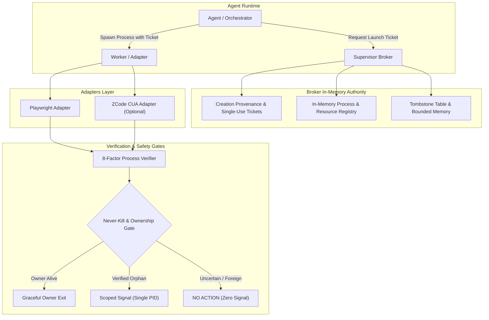
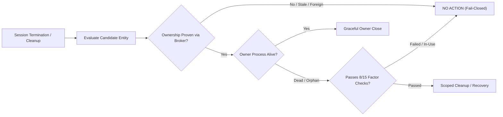

# Open Computer-Use Supervisor

> **Open Computer-Use Supervisor is a session-scoped lifecycle and safety layer for AI computer-use agents, designed to manage only processes and temporary resources that the current session can prove it created.**

[](https://github.com/timexingxin/open-computer-use-supervisor/actions)
[](https://opensource.org/licenses/Apache-2.0)
[](https://github.com/timexingxin/open-computer-use-supervisor/releases)
[](SECURITY.md)

---

## The Core Invariant

```text
Observe
   ↓
Prove Ownership
   ↓
Prefer Owner Shutdown
   ↓
Recover Verified Orphans
   ↓
Leave Uncertain Resources Alone
```

> ### **"If ownership is uncertain, do nothing."**

When AI agents drive computer-use frameworks (e.g. headless browsers, desktop automation tools, accessibility runtimes), unexpected agent crashes or aborts can leave behind stray processes, leaked profiles, orphaned helper daemons, or lingering Unix sockets.

Traditional process killers use coarse pattern-matching (`killall chromium`, `pkill -f node`), which risks terminating the user's primary browser, destroying active development sessions, or causing catastrophic data loss.

**Open Computer-Use Supervisor** provides a provenance-backed barrier: **no process is ever signaled, and no file is ever unlinked, unless the current active session can establish fail-closed, multi-factor ownership verification that it was responsible for launching or creating that specific entity.**

---

## What This Project Is NOT

To prevent confusion, Open Computer-Use Supervisor is strictly scoped:
- :x: **Not a computer-use model** (it does not generate clicks, coordinates, or keystrokes).
- :x: **Not a desktop automation engine** (it does not control the OS or automate UI).
- :x: **Not a replacement for Playwright** (it supervises Playwright lifecycles).
- :x: **Not ZCode CUA** (it contains zero proprietary ZCode source code or binaries).
- :x: **Not a generic process killer** (it does not hunt or clean arbitrary processes).
- :x: **Not a background system daemon** (it runs strictly bounded within active agent sessions).

**It IS a lifecycle safety supervisor** that ensures agentic experiments remain clean, bounded, and incapable of harming host workstation state.

---

## Architecture Overview



### Lifecycle Decision Flow



---

## Key Safety Invariants

1. **Fail-Closed Default**:
   All verification routines fail closed. In any case of PID reuse, timestamp mismatch, symlink indirection, or missing memory receipts, the engine takes **ZERO ACTION**.
2. **Memory-Only Authority**:
   Ownership authority exists exclusively in Broker volatile memory. On-disk state files cannot grant attestation without an active, verified Broker session receipt.
3. **Single-Use Launch Tickets**:
   Processes can only enter the supervised hierarchy if issued a single-use capability ticket prior to spawn, verified against caller PID, PPID, and nanosecond start timestamps.
4. **Never-Kill Policy**:
   User Google Chrome, system daemons (`launchd`, `WindowServer`), IDE language servers, and standalone user applications are permanently hardcoded as `NEVER_KILL`.
5. **No Blind Process Group Kills**:
   Signal dispatch is strictly target-bound to a single verified PID. Negative PIDs (`kill(-pgid)`) and process group sweeps are forbidden.
6. **TOCTOU-Hardened Resource Cleaner**:
   File unlinking checks device ID, inode match, symlink status, and open file handles via `fstat/lstat` immediately prior to unlink.
7. **Idempotency & Double-Action Safety**:
   Duplicate signal attempts return `TARGET_ALREADY_EXITED`; duplicate unlinks return `NOOP_ALREADY_CLEAN` without polluting audit accounting counters.

---

## Threat Model & Honest Limitations

Open Computer-Use Supervisor is designed under a defense-in-depth model with realistic boundaries:

- :white_check_mark: **Defends Against**: Accidental process leaks, rogue agent children, PID wrap-around/reuse, TOCTOU symlink swaps within user permissions, corrupted session state, and rogue test cleanup scripts.
- :warning: **Honest Limitations**:
  - **No Kernel-Level Isolation**: Does not protect against local root attackers or processes with `ptrace`/debugger privileges.
  - **Userspace TOCTOU Window**: Path unlinking contains a standard sub-millisecond userspace race window (mitigated via dev/inode rechecks and fail-closed validation, but not mathematically instantaneous).
  - **Platform Focus**: Primary test coverage currently focuses on macOS and POSIX environments.

See [`docs/THREAT_MODEL.md`](docs/THREAT_MODEL.md) for full formal attack surface analysis.

---

## Getting Started

### Installation

```bash
git clone https://github.com/timexingxin/open-computer-use-supervisor.git
cd open-computer-use-supervisor
npm install
```

### Running the Test Suite

```bash
npm test
```

> **133 automated tests passed in the release validation environment**, covering unit predicates, adversarial edge cases, double-action idempotency, and 5-cycle soak integration.

### Quick Example

```javascript
import { SupervisorBroker } from 'open-computer-use-supervisor';

// Initialize session broker
const sessionId = `agent-session-${Date.now()}`;
const broker = new SupervisorBroker(sessionId);
await broker.start();

// Request single-use launch ticket for disposable worker
const ticket = broker.issueLaunchTicket({
  role: 'playwright-worker',
  expectedLauncherPid: process.pid
});

// Launch child with ticket and attest
// ...
await broker.stop();
```

---

## Production Safety Notice

> [!CAUTION]
> **General destructive production cleanup is permanently disabled by default.**
> The release candidate ships with `executeAllowed = false`. Any command line invocation of `cleanup --execute` without an explicit, attested test harness will abort with code `1`.

---

## Project Structure

```text
open-computer-use-supervisor/
├── src/
│   ├── core/                  # Core Broker, Verifier, Cleaner, Terminator
│   ├── adapters/
│   │   ├── playwright/        # Playwright browser lifecycle adapter
│   │   └── zcode-cua/         # Optional ZCode CUA interoperability adapter
│   └── cli/                   # Supervisor CLI commands
│
├── tests/
│   ├── fixtures/              # Synthetic mock process fixtures
│   └── *.test.mjs             # 16 comprehensive test suites (133 tests)
│
├── docs/
│   ├── ARCHITECTURE.md        # System architecture specification
│   ├── THREAT_MODEL.md        # Threat model & attack mitigations
│   ├── SECURITY_MODEL.md      # Fail-closed security rules
│   ├── PLAYWRIGHT_ADAPTER.md  # Playwright adapter specification
│   ├── ZCODE_CUA_ADAPTER.md   # ZCode interoperability specification
│   └── security/              # Soak and red team reports
│
├── .github/workflows/ci.yml   # GitHub Actions CI pipeline
├── LICENSE                    # Apache-2.0
├── NOTICE                     # Copyright and attribution notice
└── SECURITY.md                # Vulnerability disclosure policy
```

---

## Legal & Third-Party Disclaimer

This project is an independent open-source initiative and is **not affiliated with, maintained by, or endorsed by ZCode or other third-party runtime vendors**. Optional adapters interoperate with separately installed software through standard, publicly observable operating system and MCP mechanisms.

---

## License

Licensed under the **Apache License, Version 2.0**. See [`LICENSE`](LICENSE) for details.
