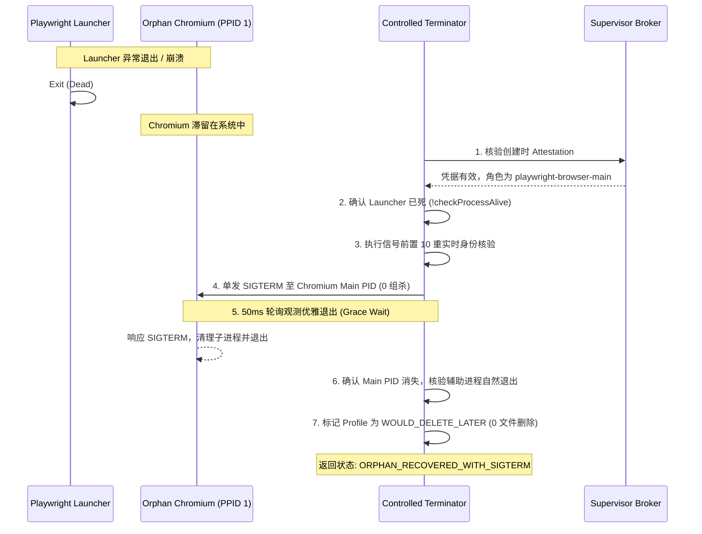

# Antigravity Process Supervisor — Phase S2.5 Playwright Controlled Lifecycle Design

> **Document Version**: 1.0.0  
> **Phase**: S2.5 (Playwright Controlled Lifecycle)  
> **Status**: APPROVED & VERIFIED (63/63 Tests PASS)  
> **Core Principle**: Playwright should clean itself first. Supervisor exists only for leftovers it can prove it owns.

---

## 1. 核心设计原则与信任边界扩展

在 Phase S2 中，Supervisor 首次通过了针对测试一次性子进程（`supervisor-disposable-test-child`）的受控信号派发验证。
Phase S2.5 将物理终止能力的边界进一步从纯测试进程谨慎扩展至**真实临时工作负载：当前测试 Session 派生的 Playwright / Chromium 子树**。

### 核心安全准则 (Core Invariants)
1. **应用自身生命周期优先（Playwright Cleans Itself First）**：
   - 绝不抢在 Playwright 自身的 `browser.close()` 或 `context.close()` 前杀伤进程。正常流程下 Supervisor 保持 0 信号。
2. **仅针对创建时已登记的全新测试实例（Creation-Time Provenance Only）**：
   - 严禁对测试开始前已存在的任何 Chromium、Chrome for Testing 或 Playwright 进程进行事后认领（Post-facto Adoption）。
3. **彻底隔离真实用户 Google Chrome（Absolute User Chrome Protection）**：
   - `/Applications/Google Chrome.app` 下的任何主程序与 Helper 二进制均为最高级别 `NEVER_KILL`，任何终止尝试均在语义层一票否决。
4. **独立测试 Profile 隔离（Test Profile Isolation）**：
   - 测试 Chromium 必须使用独立测试目录（如 `runtime/sessions/<session>/playwright-profile/`），严禁使用或污染用户 Profile。
5. **主进程优先单发终止，禁止负 PGID 组杀（Browser Main First, Zero PGID Kill）**：
   - 严禁 `kill -TERM -PGID`、`killall Chromium` 或 `pkill Chrome`。仅针对主浏览器 PID 单发 SIGTERM，等待辅助子进程随管道自然消亡。
6. **资源删除继续锁定（Zero File Deletion in S2.5）**：
   - 遗留的 Profile 目录与临时缓存标记为 `WOULD_DELETE_LATER`，物理删除依然锁定留待 S3。

---

## 2. 完整派生谱系链 (Creation Provenance Chain)

每个允许在 Phase S2.5 中被终止的 Chromium 进程，必须从根源具备完整的创建时信任链：

```text
Antigravity Session Root (language_server / runner)
        │
        ▼ (持有纯内存 Launcher Capability Token)
Supervisor Broker (Unix Domain Socket 0600)
        │
        ▼ (签发 Launch Ticket: role = 'playwright-browser-main')
Trusted Playwright Launcher (Node.js script / MCP worker)
        │
        ▼ (spawn 派生 Chromium 实例，指定专属 Profile 与 port/pipe)
Chromium Main Browser Process (chrome-headless-shell)
        │  [Broker 内存登记: SPAWN_ATTESTED, OWNED_CONFIRMED]
        │
        ├──► GPU Process (chrome-headless-shell --type=gpu-process)
        ├──► Utility Process (network.mojom.NetworkService)
        └──► Renderer Process (chrome-headless-shell --type=renderer)
           [Broker 内存登记: PLAYWRIGHT_ATTESTED, 强绑定 parentBrowserPid]
```

### 谱系约束要求：
* **Launcher PID 绑定**：Chromium 主进程在派生时，其操作系统 `PPID` 必须强等于持有 Launch Ticket 的 Launcher PID。
* **辅助子进程绑定**：所有 GPU、Renderer、Utility 辅助进程，其 `PPID` 或进程树必须向上追溯至已核验的 `mainPid`，并通过 `attestPlaywrightHelper` 完成内存登记。

---

## 3. 区分两类浏览器环境 (User Chrome vs Playwright Test Chromium)

| 判定维度 | 用户真实 Google Chrome | S2.5 Playwright 测试 Chromium |
| :--- | :--- | :--- |
| **可执行文件路径** | `/Applications/Google Chrome.app/Contents/MacOS/Google Chrome` | `~/.cache/ms-playwright/.../chrome-headless-shell` |
| **执行上下文** | 用户日常会话、登录态、个人数据 | 会话私有沙箱 `runtime/sessions/<session>/playwright-profile/` |
| **所属用户与权限** | 普通用户日常交互 | 由 Antigravity Session Broker 签名派生 |
| **Supervisor 状态** | **`NEVER_KILL` (USER_BROWSER) — 绝对硬锁定** | **`OWNED_CONFIRMED` (受控生命周期管理)** |
| **允许的操作** | **0 信号，0 触碰，仅允许 CDP 结构化后台复用** | **优先 Graceful Close，孤儿残留允许受控 SIGTERM** |

---

## 4. 两级生命周期终止协议 (Two-Tier Termination Protocol)

### 第一级：优雅关闭优先 (Tier 1: Graceful Playwright Shutdown)
* **执行方式**：调用 Playwright 官方 API `await browser.close()` 或 `await context.close()`。
* **内核反应**：Chromium 主进程接收关闭事件，主动切断内部 IPC 并协同 GPU、Renderer 退出。
* **Supervisor 动作**：被动观测，**派发系统信号数 = 0**。
* **最终状态**：`CLOSED_BY_OWNER_GRACEFULLY`。

### 第二级：孤儿浏览器恢复 (Tier 2: Orphan Browser Recovery)
当 Playwright Launcher 意外崩溃（如父进程被 SIGKILL、连接管道断开），但 Chromium 主进程仍滞留系统（成为 PPID=1 的孤儿进程）时触发：



---

## 5. Crashpad 处理器专项审计策略 (Crashpad Special Audit)

Chromium 的 `crashpad-handler` 具备特殊生命周期特征：
1. 它由主进程启动，但在特定平台可能脱离父子关系（Reparent to init/PID 1）；
2. 它的生存时间可能略长于浏览器主进程；
3. 某些多实例环境下可能存在共享 Crashpad。

**S2.5 审计铁律**：
* **严禁基于名称模糊匹配杀伤**：绝不能仅仅因为进程命令行中包含 `crashpad` 就发送信号。
* **无凭据一律 OBSERVE_ONLY**：只有在创建时明确捕获其 PID，且确认其仅服务于当前已终止测试实例时，才在主进程退出后进行单 PID 回收。未登记的 Crashpad 一律降级为 `OBSERVE_ONLY`。

---

## 6. 后台模式与持久化模式比对 (Persistent vs Background)

在 S2.5 中，对两种模式的生命周期进行了实机比对：

| 特征维度 | `playwright-background` | `playwright-persistent` |
| :--- | :--- | :--- |
| **API 入口** | `chromium.launch({ headless: true })` | `chromium.launchPersistentContext(userDataDir, ...)` |
| **Profile 行为** | 临时隔离目录，内存/自动回收 | 显式绑定的磁盘目录（`agent-default` 或专用测试目录） |
| **主进程形态** | `chrome-headless-shell` | `chrome-headless-shell` |
| **典型子进程树** | Main + GPU + Network Utility (+ Renderer) | Main + GPU + Network Utility (+ Renderer) |
| **优雅关闭方式** | `browser.close()` | `context.close()` |
| **S2.5 回收策略** | 识别主 PID 单发 SIGTERM | 识别主 PID 单发 SIGTERM |
| **残余文件处置** | 标记 `WOULD_DELETE_LATER` | 标记 `WOULD_DELETE_LATER` (绝不物理 rm) |

---

## 7. 生产锁与防抖动纪律

* **CLI 生产门禁继续锁定**：`PHASE_V0_1_CONFIG.executeAllowed = false`。运行 `agy-supervisor cleanup --execute` 会直接抛出 `PHASE_S2_5_PRODUCTION_EXECUTE_LOCKED_PROGRESSIVE_EXPANSION`。
* **双浏览器隔离保证（Twin Browsers Guarantee）**：在 Browser A 与 Browser B 并行运行时，针对 Browser A 的恢复操作仅波及 Browser A 自身，Browser B 及其页面完全不受干扰且持续可交互。
